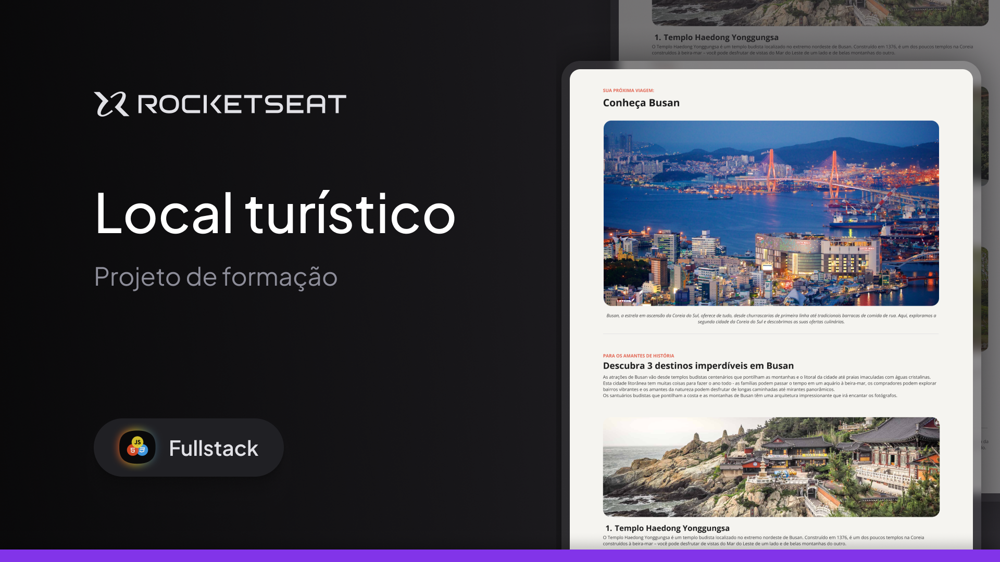

  

  <a href="#-projeto">Projeto</a>&nbsp;&nbsp;&nbsp;|&nbsp;&nbsp;&nbsp;
  <a href="#-tecnologias">Tecnologias</a>

  

 

## 👩🏻‍💻 Projeto

Este projeto é uma página web desktop com informações sobre um local turístico.
Esse é um dos desafios práticos da formação Fullstack, um de nossos conteúdos de especialização.

## 🚀 Tecnologias

Esse projeto foi desenvolvido com as seguintes tecnologias:

- HTML
- CSS

## 

 Feito com 💜 by Palloma Gualter :wave:

